

  
  
  
  

# Arga's Dice Roller

At its core, ADR is a system-agnostic dice module for Foundry VTT that also gives the GM the option to pick a random player via a Fate Roll.

In addition, ADR can enable extensive features and dice mechanics for the **Savage Worlds Adventure Edition (SWADE)** game system, such as Critical Failures, Benny rerolls, Request Rolls, and Dramatic Tasks.

<table align="center">
  <tr>
    <td align="center">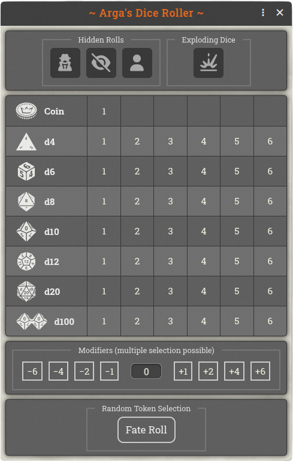</td>
    <td align="center">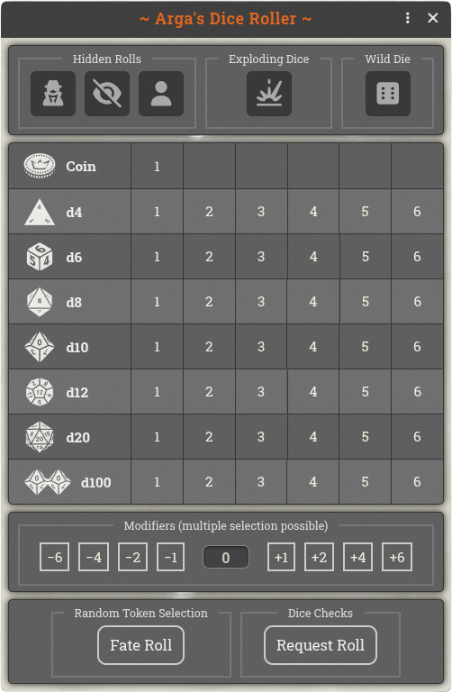</td>
  </tr>
  <tr>
    <td align="center"><em>Dice Roller Default (GM)</em></td>
    <td align="center"><em>Dice Roller SWADE (GM)</em></td>
  </tr>
</table>

 

For the chat display, the *Fantasy* and *Modern* theme graphics are available. Alternatively, the Foundry default can be used.

<table align="center">
  <tr>
    <td align="center">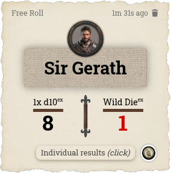</td>
    <td align="center">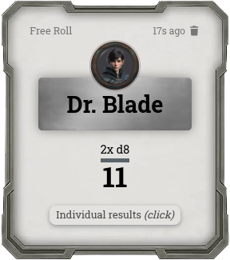</td>
  </tr>
  <tr>
    <td align="center"><em>Fantasy Theme (SWADE)</em></td>
    <td align="center"><em>Modern Theme (default)</em></td>
  </tr>
</table>

 

## General Features
Regardless of the game system, ***Arga's Dice Roller*** offers the following features:
- ***Dice Window:*** Clicking the orange d20 icon in the left control panel opens the dice window with the standard dice d4, d6, d8, d10, d12, and d20. Optionally available: d2, d100, and coin tosses.

<table align="center">
  <tr>
    <td align="center">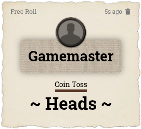</td>
    <td align="center">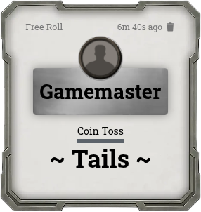</td>
  </tr>
  <tr>
    <td align="center"><em>Coin Toss (Theme: Fantasy)</em></td>
    <td align="center"><em>Coin Toss (Theme: Modern)</em></td>
  </tr>
</table>

 

- ***Mixed Rolls:*** Holding the Ctrl key while clicking a die button lets you combine several die types (e.g. 2× d8 and 1× d6). Releasing the Ctrl key then triggers the roll.
- ***Exploding Dice:*** When a die rolls its maximum, it is rolled again and the results are added together. You can configure whether dice may explode multiple times or only once. In the chat, dice that are able to explode are marked with a superscript "ex".
- ***Modifiers:*** The optional modifier buttons range from -6 to +6 and can be applied cumulatively. Alternatively, you can enter the modifier freely (up to two digits). The modifier does not affect the individual dice, only the total result (and the result of the SWADE Wild Die). The modifiers in effect are highlighted in color on the chat card.
- ***Individual Results:*** Every chat card with a dice roll has a button for displaying the individual results. For example, when several different dice have been rolled, or when a roll has been rerolled with a Benny in SWADE, it can sometimes matter which die produced which result.
- ***Fate Roll (GM only):*** On the canvas, the GM selects all the tokens to choose randomly between. After pressing the "Fate Roll" button, one of the selected tokens is picked at random and its name is announced in the chat.

<table align="center">
  <tr>
    <td align="center">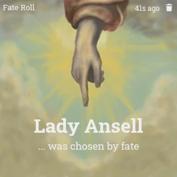</td>
  </tr>
  <tr>
    <td align="center"><em>Fate Roll</em></td>
  </tr>
</table>

 

## Features for Savage Worlds (SWADE)
When the SWADE system is active, additional buttons are unlocked automatically and the dice mechanics of Savage Worlds are applied:
- ***Wild Die:*** An additional d6 that can always explode. It is rolled alongside the Trait dice and produces its own result. The better result counts for the roll. Both dice are listed separately in the chat.
- ***Benny Reroll:*** Actors can reroll their roll by spending a Benny. By the rules, however, the new result cannot be worse than the previous one — unless the new roll is a Critical Failure. When a roll has been rerolled with a Benny, this is documented in the chat and the Benny button receives a green border.
- ***Fumble Detection:*** When the module detects a Critical Failure, the Benny reroll is disabled. *(GM only:)* If an Extra rolls a 1 on a check, the GM has the option to either accept the roll or check for a Critical Failure with a d6. ***NOTE:*** To save space, the SWADE term "Critical Failure" has been replaced with "Fumble" in some places.

<table align="center">
  <tr>
    <td align="center">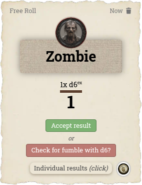</td>
  </tr>
  <tr>
    <td align="center"><em>GM-Check for fumble (Theme: Fantasy)</em></td>
  </tr>
</table>

 

### Request Roll (GM only):
The GM sends roll requests to one or more actors (to players or to NPCs placed on the canvas):

- ***Individual Rolls:*** Each actor rolls with an individual Trait. The GM can also request rolls from several actors at once. As soon as an actor is selected, all Traits that this actor possesses are displayed.

<table align="center">
  <tr>
    <td align="center">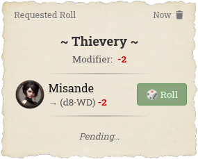</td>
  </tr>
  <tr>
    <td align="center"><em>Requested Roll (Theme: Fantasy)</em></td>
  </tr>
</table>

 

- ***Group Check:*** All selected player characters (this time not NPCs) test the same Trait (e.g. Notice). As long as no character has been selected, all Traits that at least one of the characters possesses are displayed below. Traits that not every character has are highlighted in yellow. When hovering over a character, the Traits that character does not have are shown in red. When hovering over a Trait, a tooltip displays all actors that have it. ***NOTE ON REQUEST ROLLS:*** If only the Trait to be tested is clicked, *all* available players are selected automatically.

<table align="center">
  <tr>
    <td align="center">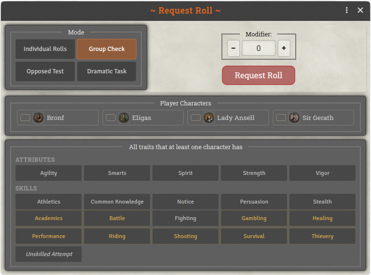</td>
  </tr>
  <tr>
    <td align="center"><em>Group Check</em></td>
  </tr>
</table>

 

<table align="center">
  <tr>
    <td align="center">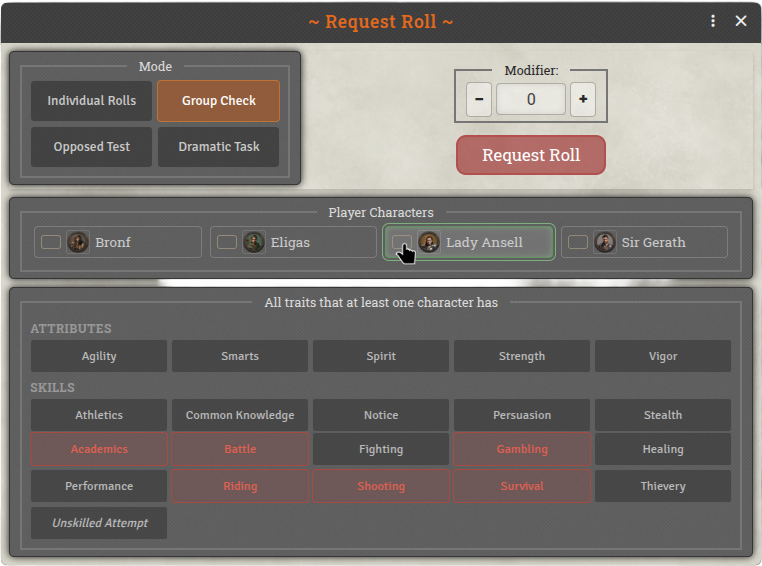</td>
  </tr>
  <tr>
    <td align="center"><em>Group Check (Mouse over a Character)</em></td>
  </tr>
</table>

 

<table align="center">
  <tr>
    <td align="center">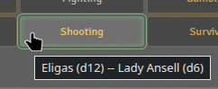</td>
  </tr>
  <tr>
    <td align="center"><em>Group Check (Mouse over a Trait)</em></td>
  </tr>
</table>

 

- ***Opposed Test:*** Two actors compete against each other with individual Traits (e.g. Notice vs. Stealth). The winner is highlighted in color in the chat.

<table align="center">
  <tr>
    <td align="center">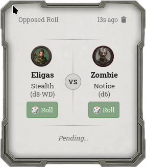</td>
    <td align="center">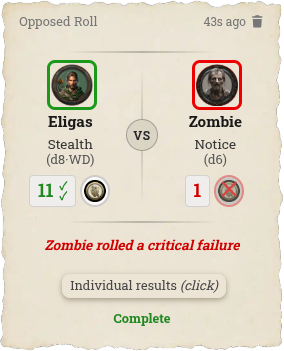</td>
  </tr>
  <tr>
    <td align="center"><em>Opposed Test -Pending- (Theme: Modern)</em></td>
    <td align="center"><em>Opposed Test -Complete- (Theme: Fantasy)</em></td>
  </tr>
</table>

 

- ***Dramatic Task:*** One or more actors must achieve a certain number of successes with an individual Trait within a number of rounds set by the GM. The GM can choose the parameters freely, or use the corresponding buttons to set the difficulty levels suggested by the SWADE rules. During a Dramatic Task, the module manages the task's progress and guides the player through their options with buttons, such as Supporting other actors. Each round, the module simulates drawing Action Cards and accounts for the rules effects of Joker or Club cards.

<table align="center">
  <tr>
    <td align="center">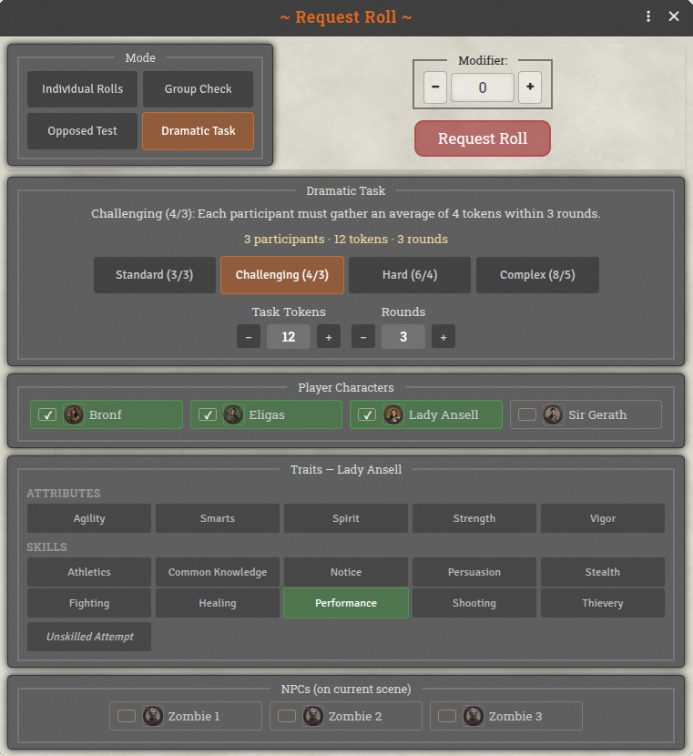</td>
    <td align="center">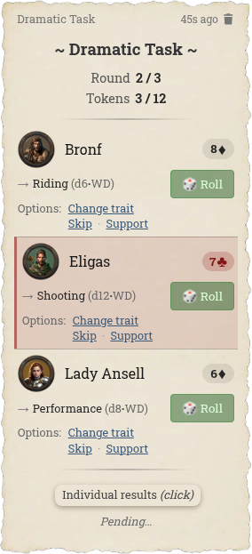</td>
  </tr>
  <tr>
    <td align="center"><em>Request a Dramatic Task</em></td>
    <td align="center"><em>Dramatic Task in Chat</em></td>
  </tr>
</table>

 

- ***Unskilled Attempts:*** When the module detects that a requested Trait is not available on an actor, an "unskilled" roll of d4-2 is made automatically.

 

## Miscellaneous
- ***Localization:*** The module is currently available in English and German.
- ***Dice So Nice:*** If the DSN module is installed and active, all rolls — including the Wild Die, exploding dice, and Bennies — are rendered with the familiar 3D animations.

 

---

## My Other Modules
If you like ***Arga's Dice Roller***, feel free to check out my other modules as well:

* **[Arga's Day-Night Slider](https://github.com/Arga-Mods/argas-day-night-slider)** – A slider for a smooth day/night transition in your scenes.
* **[Arga's Benny & Wound Panel (SWADE)](https://github.com/Arga-Mods/argas-benny-and-wound-panel-swade)** – A panel for quick adjustment of Bennies, Wounds, and Fatigue on selected tokens. Designed for Savage Worlds.

---

<em>Enjoy — Arga</em>

